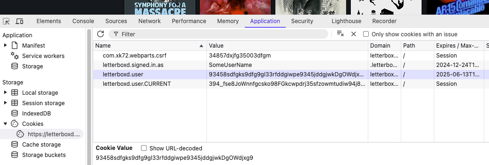

# PlexBridge

PlexBridge is a Docker-based web application that can be used to automatically sync your watches and ratings from Plex to Trakt and/or Letterboxd.

**_PlexBridge uses Plex webhooks which is a premium Plex feature and requires a Plex Pass subscription._**


## How to use

You can use Docker Compose to launch the application (on port 8000 by default). Here is an example compose.yml file:

```yaml
services:
  plexbridge-app:
    image: ghcr.io/vandaahl/plexbridge:latest
    restart: unless-stopped
    volumes:
      - ./logs:/app/var/log
      - ./settings.json:/app/var/settings.json
      - ./trakt-token-data.json:/app/var/trakt-token-data.json
    environment:
      # Port in URL must match port assigned to nginx
      - TRAKT_REDIRECT_URL=http://localhost:8000/redirect
      - TZ=Europe/Amsterdam
    ports:
      - "8000:8080"
    secrets:
      - trakt_client_id
      - trakt_client_secret
      - letterboxd_cookie_user_value
      - letterboxd_cookie_csrf_value

secrets:
  trakt_client_id:
    file: secrets/trakt_client_id.txt
  trakt_client_secret:
    file: secrets/trakt_client_secret.txt
  letterboxd_cookie_user_value:
    file: secrets/letterboxd_cookie_user_value.txt
  letterboxd_cookie_csrf_value:
    file: secrets/letterboxd_cookie_csrf_value.txt
```
When you run the command `docker compose up -d`, this starts the app at http://localhost:8000. Take note of the port: if you would like to use another port instead of port 8000, replace both instances in TRAKT_REDIRECT_URL=http://localhost:8000/redirect and in 'ports:
      - "8000:80"'. If you are not running the app on http://localhost but for instance an IP-address, change the value of TRAKT_REDIRECT_URL environment variable to the correct IP, e.g. http://192.168.1.200:8000.

### Plex

PlexBridge relies on Plex webhooks. You will need to create a webhook so Plex can communicate with PlexBridge: go to Plex > Settings > Webhooks and add a new webhook. Enter the address of PlexBridge with the suffix **/sync**, e.g. http://localhost:8000/sync or http://192.168.1.200:8000/sync, depending on the IP-address of your PlexBridge container.

### Trakt

If you want to enable Trakt integration, go to [https://trakt.tv/oauth/applications](https://trakt.tv/oauth/applications) and set up a new application. In the 'Redirect uri' field, enter the value of your TRAKT_REDIRECT_URL environment variable. Check the 'scrobble' checkbox.
When you save the new application, you will get a **Client ID** and a **Client Secret**. You need to store these as Docker secrets in a folder called 'secrets' in the root of your project. Create a **trakt_client_id.txt** file and paste your client ID. For your client secret, create a **trakt_client_secret.txt** file and do the same.

Now when you open the PlexBridge app, on the upper right of the screen you can log in to Trakt. 

### Letterboxd

Since Letterboxd has no public API, PlexBridge offers fragile support based on cookies and form submissions with HTTP requests. You will need to log in to the Letterboxd website and copy the contents of your user cookie and csrf cookie and paste them in two Docker secret files. This is done as follows:

1. Log into https://letterboxd.com on a desktop computer with your Letterboxd account. **Make sure to check the 'Remember me' checkbox.**
2. Right click anywhere on the page and in the context menu, click on 'inspect'. If you are using Safari, first go to Settings > Advanced and click on the 'Show features for web developers' checkbox to enable the Inspect feature (called 'Inspect Element' in Safari).
3. In the inspector window that pops up, click on the Storage tab (Firefox/Safari) or Application tab (Chrome). On the left side menu of the inspector window, under Cookies click on https://letterboxd.com.
4. You will see four cookies (remember that you must be logged in). The two cookie values we need are those of the cookies named **com.xk72.webparts.csrf** and **letterboxd.user**. Inside a folder called 'secrets' in the root of your project,
create two files: **letterboxd_cookie_csrf_value.txt** and **letterboxd_cookie_user_value.txt**. Put the values of the corresponding cookies in there.

5. Take note of the cookie expiration date of the letterboxd.user cookie. After that date, you will need to log in to the Letterboxd website again and redo the steps above.

**Important: if you at any time log out of the Letterboxd website, your cookies will expire, and you will have to repeat the steps above to get and save new cookie values.**

## Software used

- PHP 8.2
- Symfony 7.2
- Nginx
- Open Props CSS library
- Official Trakt API
- Letterboxd integration based on cookies